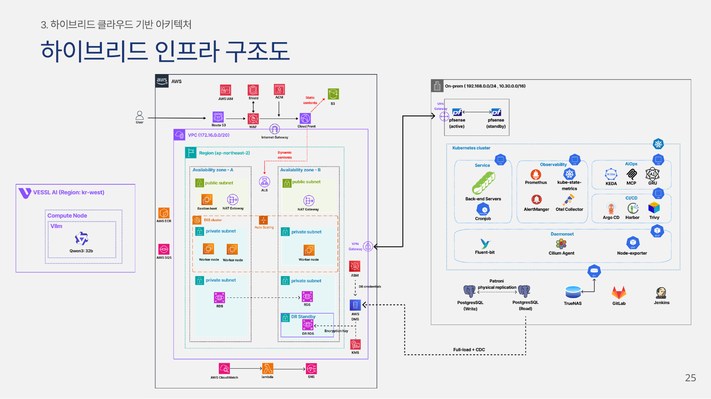
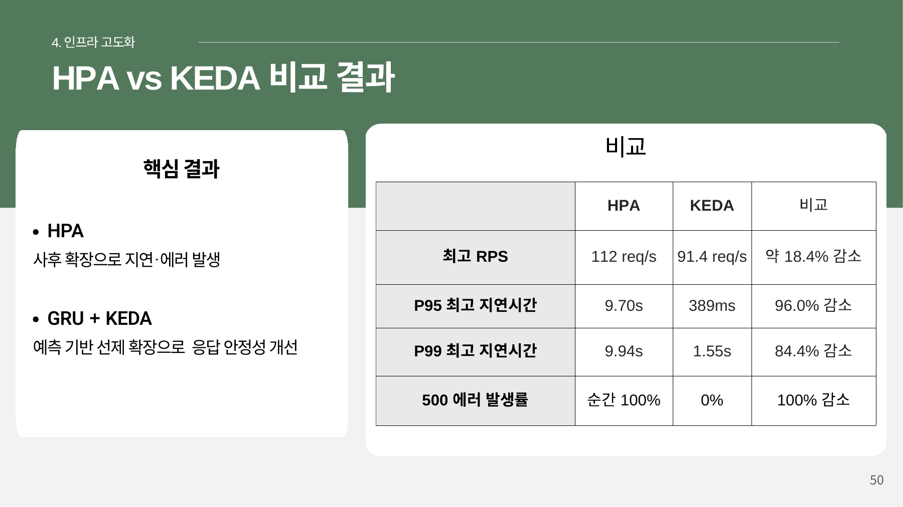

<div align="center">

# 콩콩팥팥

### 농민을 위한 대안 신용평가 기반 BNPL 플랫폼

농업 데이터를 바탕으로 농민에게 맞춤형 구매 한도를 제공하고,<br />
시계열 예측 기반 오토스케일링과 통합 관측성을 갖춘 하이브리드 클라우드 시스템입니다.


<br />


</div>

---

## 📑 목차

1. [프로젝트 개요](#-프로젝트-개요)
2. [대안 신용평가 모델](#-대안-신용평가-모델)
3. [주요 서비스 기능](#-주요-서비스-기능)
4. [시스템 아키텍처](#️-시스템-아키텍처)
5. [인프라 및 기술적 특징](#️-인프라-및-기술적-특징)
6. [성능 개선](#-성능-개선)
7. [기술 스택](#️-기술-스택)
8. [트러블슈팅](#-트러블슈팅)
9. [테스트 및 품질](#-테스트-및-품질)
10. [팀원 소개](#-팀원-소개)
11. [리포지토리](#-리포지토리)

---

## 📌 프로젝트 개요

### 기획 배경

농민은 고정 급여가 없어 기존 신용평가만으로 상환 능력을 충분히 증명하기 어렵습니다. 계절에 따라 수입이 크게 달라지고, 금융기관에 기록되지 않는 농업 활동도 많아 필요한 시점에 적절한 금융 지원을 받기 어렵다는 문제가 있습니다.

콩콩팥팥은 이 문제를 해결하기 위해 농민의 실제 영농 데이터를 활용합니다. 농민이 필요한 농자재를 먼저 구매하고 수확 이후 상환할 수 있도록, 대안 신용평가 결과에 따라 개인별 BNPL 한도를 제공합니다.

### 프로젝트 목표

- **농업 특화 대안 신용평가**: 경작 면적, 작물재해보험 가입 여부, 주 재배 품목과 상환 행동을 반영해 농민의 신용도를 평가합니다.
- **농민 전용 BNPL 서비스**: 농자재 구매부터 월별 이자 납부, 원금 상환까지 하나의 흐름으로 제공합니다.
- **하이브리드 클라우드**: 금융 원장과 민감 데이터는 온프레미스에, 확장성과 접근성이 필요한 서비스는 AWS에 배치합니다.
- **예측형 운영 자동화**: 과거 트래픽을 학습한 GRU 모델과 KEDA를 결합해 트래픽 증가 전에 리소스를 확장합니다.
- **AIOps와 통합 관측성**: 로그, 메트릭, 트레이스와 내부 토폴로지를 활용해 장애 원인과 조치 방향을 자동 분석합니다.

> 우리 FISA 클라우드 엔지니어링 5기 최종 프로젝트 - 데브식스

---

## 🧮 대안 신용평가 모델

콩콩팥팥은 신규 가입자의 정적 농업 정보와 서비스 이용 이후의 행동 데이터를 단계적으로 결합합니다.

| 점수 | 평가 시점 | 주요 평가 데이터 | 역할 |
| --- | --- | --- | --- |
| **ASS** | 신규 가입 | 농업경영체 등록 기반 경작 면적, 농작물 재해보험 가입 여부, 주 재배 품목 | 초기 신용 점수 산정 |
| **BSS** | 한도 승인 후 | 이자·원금 상환 이력, 연체 및 연체 해소 이력, 한도 사용률 | 월별 행동 점수 산정 |
| **CSS** | 최종 평가 | 신규 신청자는 ASS, 기존 이용자는 ASS와 BSS를 함께 반영 | 최종 신용 점수와 BNPL 한도 결정 |

### 결제 워크플로

```text
최초 거래
ASS 및 CSS 산출
  -> BNPL 거래 및 월별 이자 납부
  -> 월별 이자 납부와 연체 현황을 반영해 BSS 산출
  -> 원금 상환 및 거래 종료

재거래
ASS와 기존 BSS를 합산해 CSS 갱신
  -> BNPL 거래 및 월별 이자 납부
  -> 행동 데이터를 반영해 BSS 갱신
  -> 원금 상환 및 거래 종료
```

---

## ✨ 주요 서비스 기능

| 기능 | 설명 |
| --- | --- |
| **사용자·인증** | 회원가입, 로그인, 인증과 결제 PIN 검증을 제공합니다. |
| **대안 신용평가** | 농업 정보와 상환 행동을 바탕으로 신용 점수, 산출 근거와 최종 결과를 제공합니다. |
| **농부 프로필** | 기본 정보, 작물 종류, 경작 면적과 보험 가입 정보를 관리합니다. |
| **한도 관리** | 신용평가 결과에 따라 BNPL 한도를 부여하고 사용·잔여 한도를 관리합니다. |
| **상품 주문·조회** | 농자재 상품을 조회하고 BNPL 주문과 주문 상태를 관리합니다. |
| **원장 관리** | 대출·이자·연체 원장을 생성하고 상환 내역을 기록합니다. |
| **상환 및 연체** | 만기 기한에 따라 원금과 이자를 상환하고 연체 발생·해소 이력을 반영합니다. |
| **관리자 대시보드** | 농부, 한도, 주문, 상환, 연체, 원장과 감사 로그를 통합 조회합니다. |
| **AIOps** | 운영 데이터로 이상을 탐지하고 LLM 기반 장애 원인 분석과 조치 가이드를 제공합니다. |

---

## 🏗️ 시스템 아키텍처

AWS, 온프레미스 데이터센터와 VESSL AI를 연결한 하이브리드 아키텍처입니다. MSA 서비스는 역할과 데이터 민감도에 따라 AWS EKS와 온프레미스 Kubernetes에 분산하고, Site-to-Site VPN을 통해 사설 통신합니다.

<div align="center">
  
</div>

### 영역별 구성

| 영역 | 구성 | 역할 |
| --- | --- | --- |
| **AWS Cloud** | Route 53, CloudFront, S3, ALB, EKS, ECR, RDS, DMS, SQS, CloudWatch | 정적 웹 호스팅, 외부 진입점, 확장형 서비스, 비동기 메시지, DR과 클라우드 모니터링 |
| **On-premises** | pfSense, HAProxy, Kubernetes, PostgreSQL, Patroni, etcd, TrueNAS | 금융 원장·거래 데이터, 내부 서비스, DB 고가용성과 영구 스토리지 |
| **VESSL AI** | H100 GPU, vLLM, Qwen3 | 사내 LLM 추론과 AIOps 분석 |
| **Delivery** | GitLab, Jenkins, Harbor, Trivy, Argo CD | 빌드·검증·이미지 관리와 GitOps 배포 |
| **Observability** | Prometheus, Grafana, Loki, Tempo, OpenTelemetry, Fluent Bit, Hubble | 로그, 메트릭, 트레이스와 네트워크 흐름 통합 관측 |

### 주요 설계 결정

1. **서비스와 데이터 분리**: 외부 접근과 확장이 필요한 상품·프런트 서비스는 AWS에, 금융 원장과 민감 데이터는 온프레미스에 배치했습니다.
2. **네트워크 고가용성**: pfSense를 이중화하고 허용된 IP와 포트만 통과시키며, 내부 VLAN은 HAProxy를 통해 라우팅합니다.
3. **데이터 고가용성**: 온프레미스 PostgreSQL은 Patroni와 etcd 기반 Primary-Replica 구조로 구성하고, 읽기·쓰기를 분리하는 CQRS를 적용했습니다.
4. **클라우드 DR**: RDS를 이중화하고 DMS Full Load와 CDC로 재해 복구 경로를 구성했습니다.
5. **비동기 서비스 연계**: 인증, 상품, 결제 서비스 간 이벤트를 AWS SQS로 전달해 결합도를 낮췄습니다.

---

## ☁️ 인프라 및 기술적 특징

### 1️⃣ GRU + KEDA 기반 Predictive Autoscaling

기존 HPA는 CPU·메모리 임계치를 넘은 뒤에야 확장을 시작해 트래픽 급증 시 500 오류와 긴 지연이 발생했습니다. 과거 트래픽으로 학습한 GRU 모델이 향후 RPS를 예측하고, 예측값을 KEDA 외부 메트릭으로 전달해 필요한 Pod를 미리 확보하도록 개선했습니다.

| 지표 | HPA | GRU + KEDA | 개선 |
| --- | ---: | ---: | ---: |
| 최고 RPS | 112 req/s | 91.4 req/s | 안정성 중심으로 처리량 조정 |
| P95 최고 지연 | 9.70s | 389ms | **96.0% 감소** |
| P99 최고 지연 | 9.94s | 1.55s | **84.4% 감소** |
| 500 오류 발생 구간 | 100% | 0% | **완전 제거** |

<div align="center">
  
</div>

### 2️⃣ MCP 기반 AIOps

- 서버 CPU, 메모리, 디스크와 서비스 트래픽을 수집합니다.
- 시계열 예측 RPS와 실제 트래픽의 차이를 감지합니다.
- 예측값 초과 시 로그, 메트릭, 트레이스와 내부 토폴로지를 함께 수집합니다.
- VESSL AI의 Qwen LLM이 MCP 도구를 통해 필요한 운영 데이터만 조회합니다.
- 서비스, 네트워크, DB 경로를 시각화하고 RCA 원인 후보와 조치 방향을 Slack으로 전달합니다.
- 민감 정보는 마스킹하고, LLM과 인프라 사이에는 실행 범위를 제한하는 MCP 계층을 둡니다.

### 3️⃣ 통합 관측성과 알림

- **EKS**: CloudWatch로 노드·Pod CPU 및 메모리, 네트워크 트래픽과 오류 자원을 관측합니다.
- **온프레미스 K8s**: Prometheus 기반 리소스 모니터링과 Hubble 기반 HTTP·TCP·UDP·ICMP 네트워크 흐름을 관측합니다.
- **PostgreSQL**: 호스트 자원, 쿼리·트랜잭션 처리량, Replication Lag, Connection과 오류 로그를 관측합니다.
- **pfSense**: 이중화 상태, 자원 사용률, AWS 간 트래픽과 VLAN별 허용·차단 이벤트를 수집합니다.
- **분산 트레이싱**: OpenTelemetry로 서비스 로그와 트레이스를 연결하고 Tempo·Grafana에서 BNPL 결제 흐름을 추적합니다.
- **알림**: EKS Pod·Node 이상과 PostgreSQL CPU·메모리·디스크 임계치 초과를 Alertmanager와 Slack으로 전송합니다.

### 4️⃣ GitOps 기반 배포와 공급망 보안

```text
Developer
  -> GitLab
  -> Jenkins: Build / Test / Image Build
  -> Harbor + Trivy: Image Registry / Vulnerability Scan
  -> GitLab GitOps Repository
  -> Argo CD
  -> Kubernetes Services
```

Harbor에는 온프레미스 이미지를 저장하고 Trivy로 취약점을 검사합니다. AWS 서비스 이미지는 ECR에 저장해 EKS로 배포하며, Argo CD가 GitOps 저장소의 선언 상태와 클러스터 상태를 동기화합니다.

---

## 🚀 성능 개선

### CQRS 적용

PostgreSQL 읽기와 쓰기 책임을 분리하고 Patroni 기반 Primary-Replica 구조와 연계했습니다. k6로 100 RPS를 10분간 발생시켜 개선 전후를 비교했습니다.

| 지표 | 적용 전 | 적용 후 | 개선 |
| --- | ---: | ---: | ---: |
| 평균 응답 시간 | 50.48ms | 35.60ms | **29.5% 감소** |
| P95 응답 시간 | 68.05ms | 51.28ms | **24.6% 감소** |
| 최대 응답 시간 | 4.01s | 1.38s | **65.6% 감소** |
| Dropped Iterations | 304건 | 21건 | **93.1% 감소** |

### 컨테이너 이미지 최적화

경량 런타임 베이스 이미지, Multi-stage Build와 Spring Boot Layered JAR를 적용했습니다. 빌드 환경과 실행 환경을 분리하고, 의존성 레이어와 애플리케이션 레이어를 나눠 Docker 캐시 재사용률을 높였습니다.

#### Harbor 취약점 분석 및 제거

Harbor에 저장된 `service-payment` 이미지를 Trivy로 스캔해 애플리케이션 의존성과 런타임 패키지의 취약점을 단계적으로 제거했습니다. 아래 화면은 최적화 전, 1차 최적화와 최종 이미지를 한눈에 보여줍니다.

<div align="center">
  
</div>

| 단계 | 이미지 태그 | 이미지 크기 | 크기 변화 | 취약점 | 제거율 |
| --- | --- | ---: | ---: | ---: | ---: |
| **최적화 전** | `18a29dc` | 138.36MiB | 기준 | 122개 | 기준 |
| **1차 최적화** | `aa587b4` | 134.94MiB | 3.42MiB 감소 (2.47%) | 47개 | **61.48% 제거** |
| **최종 최적화** | `9e51b49` | 119.20MiB | 19.16MiB 감소 (13.85%) | 0개 | **100% 제거** |

##### 분석 및 해결 과정

1. **애플리케이션 의존성 분석**: Tomcat Embed, Spring Security, Netty 등 Java 의존성에서 발견된 취약 버전을 확인하고 수정 버전으로 갱신했습니다.
2. **런타임 패키지 분석**: OpenSSL 등 기존 베이스 이미지의 OS 패키지 취약점을 분리해 확인했습니다.
3. **이미지 구조 개선**: Multi-stage Build와 Spring Boot Layered JAR로 빌드 도구를 최종 이미지에서 제외하고 캐시 재사용 범위를 개선했습니다.
4. **경량 런타임 적용**: 실행에 필요한 구성만 포함한 경량 베이스 이미지로 교체해 남은 런타임 취약점을 제거했습니다.
5. **재스캔 검증**: 최종 태그 `9e51b49`를 다시 스캔해 `취약점 없음` 상태를 확인했습니다.

<details>
<summary><strong>Trivy에서 탐지한 주요 CVE 분석 화면 보기</strong></summary>

<br />


</details>

발표자료의 전체 서비스 종합 지표에서는 이미지별로 최대 128개의 취약점이 탐지됐으며, 최종 이미지에서는 모두 0개를 달성했습니다. 위 표의 122개는 첨부 화면에 표시된 `service-payment` 이미지의 개별 측정값입니다.

#### Harbor 전체 최적화 성과

| 지표 | 적용 전 | 적용 후 | 개선 |
| --- | ---: | ---: | ---: |
| Harbor 이미지 크기 | 842MB | 694MB | **17.5% 감소** |
| Harbor 최대 탐지 취약점 | 128개 | 0개 | **100% 제거** |
| 이미지 레이어 | 48개 | 32개 | **33.3% 감소** |
| 이미지 빌드 시간 | 3분 41초 | 1분 21초 | **63% 단축** |

#### ECR 이미지 최적화 전후

<table>
  <tr>
    <td align="center" width="50%">
      <strong>최적화 전</strong><br /><br />
      
    </td>
    <td align="center" width="50%">
      <strong>최적화 후</strong><br /><br />
      
    </td>
  </tr>
</table>

| 비교 항목 | 최적화 전 | 최적화 후 | 분석 |
| --- | ---: | ---: | --- |
| **이미지 크기** | 97.11MB | 49.01MB | **48.10MB 감소 (49.53% 절감)** |
| **Critical 취약점** | 1개 | 0개 | **100% 제거** |
| **High 취약점** | 3개 | 0개 | **100% 제거** |
| **Medium 취약점** | 3개 | 0개 | **100% 제거** |
| **전체 취약점** | 7개 | 0개 | **스캔 대상 취약점 완전 제거** |
| **이미지 상태** | 활성 | 활성 | 최적화 후에도 정상 배포 가능한 상태 유지 |

이미지 용량을 절반 가까이 줄여 ECR 저장 공간과 EKS 노드의 이미지 Pull 부담을 낮췄습니다. 동시에 스캔에서 발견된 Critical, High, Medium 취약점을 모두 제거해 배포 효율과 공급망 보안을 함께 개선했습니다.

### Jenkins 빌드 파이프라인 최적화

Jenkins와 Docker에서 반복 수행되던 Gradle 빌드를 제거했습니다. Jenkins가 생성한 JAR를 Docker가 패키징만 하도록 변경하고 Layered JAR 캐시를 활용했습니다.

| 구간 | 적용 전 | 적용 후 | 개선 |
| --- | ---: | ---: | ---: |
| Build | 32초 | 9초 | **71% 단축** |
| Docker Build & Push | 2분 5초 | 45초 | **64% 단축** |
| 전체 CI/CD 파이프라인 | 5분 27초 | 3분 10초 | **42% 단축** |

### LLM 입력 최적화

응답 목적 중심으로 프롬프트를 경량화하고 반복 조회 데이터에 30초 TTL 캐시를 적용했습니다.

| 지표 | 최적화 전 | 최적화 후 | 개선 |
| --- | ---: | ---: | ---: |
| 평균 응답 시간 | 3.17s | 3.07s | **3.15% 감소** |
| 요청당 평균 입력 토큰 | 1.18k | 1.06k | **10.17% 감소** |
| P95 응답 시간 | 8.67s | 8.17s | **5.77% 감소** |

---

## 🛠️ 기술 스택

| 영역 | 기술 스택 |
| --- | --- |
| **Frontend** | React, S3, CloudFront |
| **Backend** | Java 21, Spring Boot, MSA, REST API, CQRS, OpenTelemetry |
| **AI / AIOps** | GRU, KEDA, FastAPI, MCP, Qwen3, vLLM, VESSL AI |
| **Data / Messaging** | PostgreSQL, Redis, Patroni, etcd, AWS RDS, AWS DMS, AWS SQS |
| **Cloud** | AWS EKS, ECR, ALB, S3, CloudFront, Route 53, CloudWatch, SNS, Lambda |
| **On-premises** | Kubernetes, pfSense, HAProxy, TrueNAS iSCSI |
| **DevOps** | Docker, Terraform, GitLab, Jenkins, Harbor, Trivy, Argo CD |
| **Observability** | Prometheus, Grafana, Loki, Tempo, OpenTelemetry, Fluent Bit, Hubble, Alertmanager |
| **Test / Quality** | JUnit, Mockito, JaCoCo, k6 |

---

## 🔧 트러블슈팅

<details>
<summary><strong>1️⃣ HPA의 사후 확장으로 발생한 500 오류</strong></summary>

### 문제

실제 트래픽 유입보다 늦게 Pod가 확장되면서 Scale-out이 완료될 때까지 500 오류가 발생했습니다.

### 원인

HPA는 CPU·메모리 임계치를 초과한 이후에 반응하므로 급격한 트래픽 변화에 선제적으로 대응할 수 없었습니다.

### 해결

과거 트래픽을 학습한 GRU 모델로 향후 RPS를 예측하고, KEDA가 예측 결과에 맞춰 필요한 Pod를 미리 확장하도록 구성했습니다.

### 결과

P95 최고 지연을 9.70초에서 389ms로 줄였고, 테스트 구간의 500 오류를 완전히 제거했습니다.

</details>

<details>
<summary><strong>2️⃣ 컨테이너 이미지 비대화와 보안 취약점</strong></summary>

### 문제

실행에 필요하지 않은 패키지와 취약한 베이스 이미지로 인해 이미지 용량과 ECR 비용이 증가했고, Harbor에서 128개 취약점이 발견됐습니다.

### 원인

빌드 도구와 실행 환경이 한 이미지에 포함됐으며, 실행 JAR 전체가 하나의 레이어로 복사돼 작은 코드 변경에도 큰 레이어가 다시 생성됐습니다.

### 해결

경량 런타임 베이스 이미지, Multi-stage Build와 Spring Boot Layered JAR를 적용해 빌드·실행 환경과 의존성·애플리케이션 레이어를 분리했습니다.

### 결과

Harbor 취약점을 128개에서 0개로 줄이고 이미지 빌드 시간을 63% 단축했습니다. ECR 이미지도 97.11MB에서 49.01MB로 줄였으며 Critical·High·Medium 취약점을 모두 제거했습니다.

</details>

<details>
<summary><strong>3️⃣ Jenkins와 Docker의 중복 빌드</strong></summary>

### 문제

Jenkins 빌드 이후 Docker 이미지 생성 과정에서 Gradle 빌드를 다시 수행해 파이프라인이 불필요하게 길어졌습니다.

### 해결

Jenkins가 만든 JAR를 Docker가 패키징만 하도록 변경하고, 변경 빈도가 낮은 의존성 레이어는 Harbor 캐시를 재사용하도록 구성했습니다.

### 결과

Docker Build & Push를 2분 5초에서 45초로 줄이고 전체 파이프라인을 5분 27초에서 3분 10초로 단축했습니다.

</details>

<details>
<summary><strong>4️⃣ AIOps LLM의 입력 토큰 낭비</strong></summary>

### 문제

질문과 직접 관련 없는 운영 데이터까지 프롬프트에 누적돼 토큰 사용량과 P95 응답 시간이 증가했습니다.

### 해결

프롬프트를 응답 목적 중심으로 재구성하고 반복 조회 결과에 30초 TTL 캐시를 적용했습니다.

### 결과

요청당 평균 입력 토큰을 10.17% 줄이고 P95 응답 시간을 5.77% 개선했습니다.

</details>

---

## ✅ 테스트 및 품질

Mockito와 JUnit으로 단위 테스트를 작성하고 JaCoCo로 Instruction 및 Branch Coverage를 측정했습니다. 모든 백엔드 모듈에서 두 지표 모두 90% 이상을 달성했습니다.

| 모듈 | Instruction Coverage | Branch Coverage |
| --- | ---: | ---: |
| `service-batch` | 92.73% | 90.25% |
| `service-core` | 90.16% | 90.45% |
| `service-admin` | 90.57% | 90.24% |
| `service-auth` | 95.12% | 100.00% |
| `service-catalog` | 97.32% | 93.75% |
| `service-payment` | 93.79% | 92.47% |

---

## 👥 팀원 소개

| 이름 | 역할 | 담당 업무 |
| --- | --- | --- |
| **류승환** | PM / AIOps & Backend | SRE Agent 개발, SQS 비동기 처리, 내부 LLM 구축 |
| **이승준** | PL / Observability | 하이브리드 클라우드 설계, 금융 원장·배치 시스템, Observability 구축 |
| **이동욱** | AIOps & Test | AI 예측 모델, Predictive Autoscaling, MCP 기반 AIOps 백엔드, 백엔드 품질·배포 안정화 |
| **사재현** | Monitoring & On-prem | 관리자 대시보드 API, DB 이중화·HA, 온프레미스 자원·로그 모니터링 |
| **양규리** | CI/CD & Cloud | GitOps CI/CD 파이프라인, AWS 연동 인프라, 사용자 서비스 개발 |

---

## 🔗 리포지토리

| 구분 | 설명 | 링크 |
| --- | --- | --- |
| **GitHub Organization** | 콩콩팥팥 프로젝트 전체 저장소 | [FISA-Agri-Pay](https://github.com/FISA-Agri-Pay) |
| **Infrastructure** | AWS, 온프레미스, VESSL AI 하이브리드 인프라 | [infra](https://github.com/FISA-Agri-Pay/infra) |

---

## 🔭 향후 과제

- 운영 정책을 기반으로 한 AIOps 조치 자동화
- 관리자 기능과 반복 운영 절차 자동화
- OCR과 실제 농업 데이터를 활용한 신용평가 모델 고도화
- 더 많은 금융·농업 서비스와의 연계
